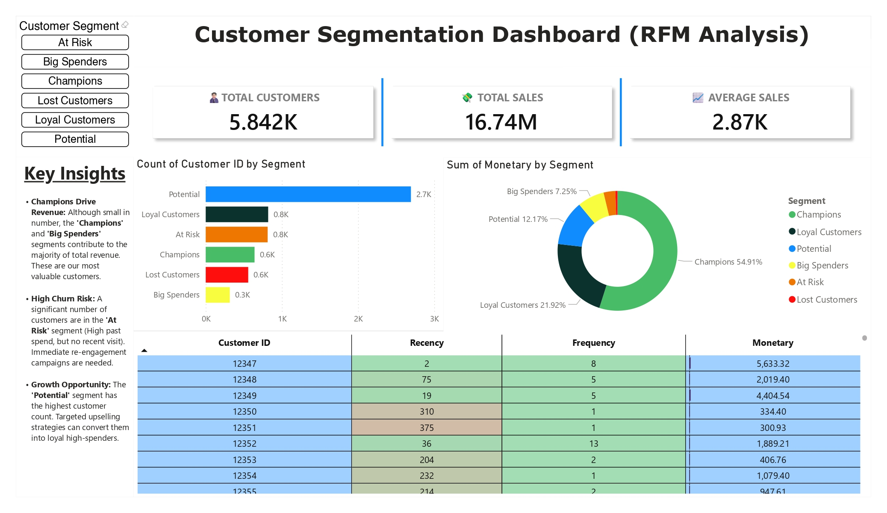

# Customer Segmentation Dashboard (RFM Analysis) 📊

## 🚀 Project Overview
This project analyzes customer purchasing behavior using **RFM Analysis** (Recency, Frequency, Monetary) to segment customers into actionable groups like 'Champions', 'At Risk', and 'Big Spenders'. The insights help in targeted marketing and retention strategies.

## 🛠️ Tech Stack
* **Python (Pandas):** For Data Cleaning, Transformation, and RFM Scoring.
* **Power BI:** For Data Visualization and Dashboarding.
* **Excel/CSV:** Raw data handling.

## 📸 Dashboard Preview

## 🔑 Key Insights
* **Revenue Concentration:** A small percentage of 'Champions' contribute to **55%** of the total revenue.
* **Churn Risk:** Over 1,200 customers are in the **'At Risk'** segment (High past spend, but no recent visit).
* **Growth Opportunity:** The **'Potential'** segment has the highest customer count, offering a huge upselling opportunity.

## 📂 Files Included
* `RMF.ipynb`: Python code for RFM Logic.
* `rfm_analysis_final.csv`: Processed dataset.
* `rmf.pbix`: Power BI Dashboard file.
